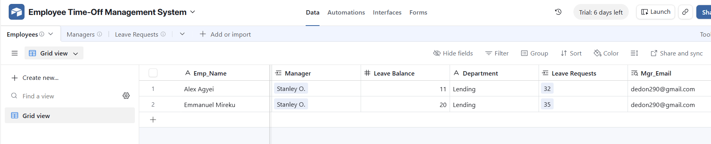
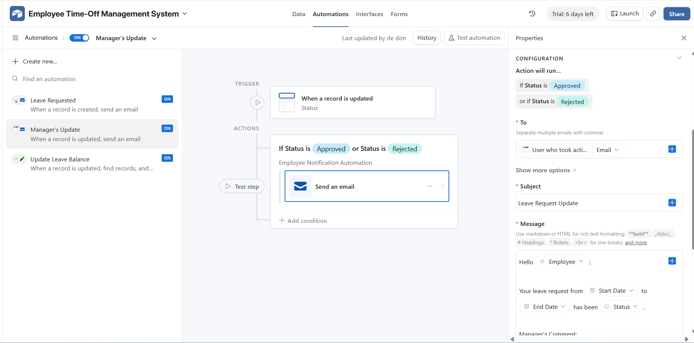
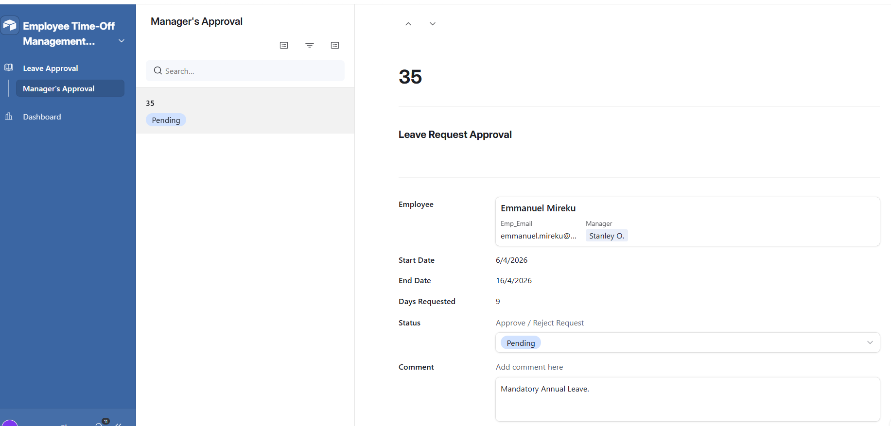

# Automated Employee Time-Off Management System

## 📌 Overview

This project implements an **Automated Employee Time-Off Management System** using **Airtable and Airtable Automations**.

The system streamlines leave management by allowing employees to submit requests, managers to approve them, and automatically updating leave balances — eliminating manual HR processes.

Each employee is allocated **20 days of Paid Time Off (PTO) annually**, and approved leave requests are automatically deducted from their remaining balance.

---

## 🏗️ System Architecture

The system follows a **three-layer architecture**:

### 🔹 Presentation Layer
- Airtable Forms (Employee submission)
- Airtable Interfaces (Manager approval dashboard)

### 🔹 Data Layer
- Airtable Base (Employees, Managers, Leave Requests tables)

### 🔹 Logic Layer
- Airtable Automations (Triggers and actions)

---

### ⚙️ Components Used

| Component | Tool |
|----------|------|
| Database | Airtable |
| Automation Engine | Airtable Automations |
| Notifications | Email |

---

## 🧱 Database Design

### 👤 Employees Table

Stores employee information and leave balances.

**Fields:**
- Employee Name  
- Email  
- Manager (Linked to Managers table)  
- Leave Balance (Default: 20 days)  
- Department  

---

### 👨‍💼 Managers Table

Stores manager information.

**Fields:**
- Manager Name  
- Manager Email  

---

### 📅 Leave Requests Table

Stores employee leave applications.

**Fields:**
- Employee (Linked to Employees table)  
- Start Date  
- End Date  
- Days Requested (Formula field)  
- Status (Pending / Approved / Rejected)  
- Manager Comment  
- Submission Date  

---

### 📊 Days Requested Calculation

The system automatically calculates leave duration while excluding weekends, ensuring only **working days (Monday–Friday)** are counted.

---

## ⚡ Automation Workflows

### 📩 1. Manager Notification Automation

**Trigger:**
- When a new leave request is created

**Action:**
- Send email notification to the manager with request details and approval link

---

### ✅ 2. Manager Approval Workflow

Managers use an **Airtable Interface** to:

- View pending requests  
- Approve or reject requests  
- Add comments  

---

### 🔄 3. Leave Balance Update Automation

**Trigger:**
- When request status changes to **Approved**

**Actions:**
1. Find employee record  
2. Calculate updated leave balance  
3. Update employee leave balance  

---

### 📬 4. Employee Notification Automation

**Trigger:**
- When request status changes to **Approved or Rejected**

**Action:**
- Notify employee with:
  - Status update  
  - Leave details  
  - Manager comment  

---

## 🔁 System Workflow

Employee submits request
↓
Leave request stored in Airtable
↓
Manager receives notification
↓
Manager reviews via interface
↓
Approve / Reject
↓
Update leave balance
↓
Notify employee

---

## 🧪 Testing

The system was tested to ensure:

- ✔ Leave requests are captured correctly  
- ✔ Manager notifications are triggered  
- ✔ Approval/rejection workflows function properly  
- ✔ Leave balances update accurately  
- ✔ Pending requests do not affect balances  

---

## ✨ Key Features

- Automated leave request submission  
- Real-time manager notifications  
- Manager approval interface  
- Automatic leave balance updates  
- Employee notification system  
- HR dashboard visibility  

---

## ⚠️ Challenges and Solutions

### Challenge:
Dynamic recalculation of leave balances due to lookup fields.

### Solution:
Used automation-based updates to persist leave balances in the Employees table instead of relying only on formulas.

---

### Challenge:
Automation failure due to incorrect record ID mapping.

### Solution:
Configured automation to use **Record ID from the “Find Records” step**, ensuring accurate updates.

---

## 🚀 Future Improvements

- Slack or Microsoft Teams integration  
- Calendar integration (Google Calendar / Outlook)  
- Leave type categorization (Annual, Sick, Unpaid)  
- HR analytics dashboard  
- Role-based access control  
- Validation rules to prevent excess leave requests  
- Annual leave balance reset automation  

---

## 🎥 Demo

Watch the demo here:

👉 https://www.youtube.com/watch?v=QGUzCWvCwB8

---

## 📸 Screenshots

## 📸 Screenshots

### Airtable Tables

### Automations

### Dashboard

---

## 🧠 Skills Demonstrated

- Workflow Automation  
- Database Design  
- Business Process Automation  
- Airtable Automations  
- No-Code Development  
- System Design  

---

## 📄 License

MIT License
